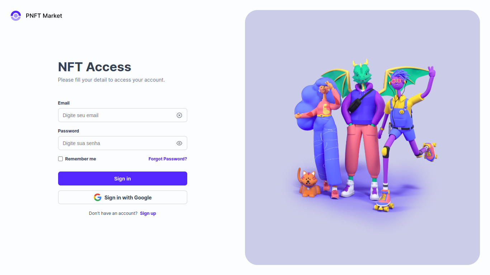

# NFT Acvess

## Descrição
Nft Access é um app que implementa login social com o google usando o module next-auth do Next.js





## Status:
 - Terminado(v1)

## Ferramentas
- Next.js
- Typescript
- Sass
-Next-Auth

## Como usar

Faça o clone deste repositório em sua máquina.

```bash
    git clone https://github.com/Ramiro-Rfn/nftaccess.git

````

Instale as dependências rodando:
```bash
    yarn 

    //ou

    npm install
````

Rode o progecto:
```bash
    yarn dev
```

### Link da Demo: https://nftaccess-kappa.vercel.app/